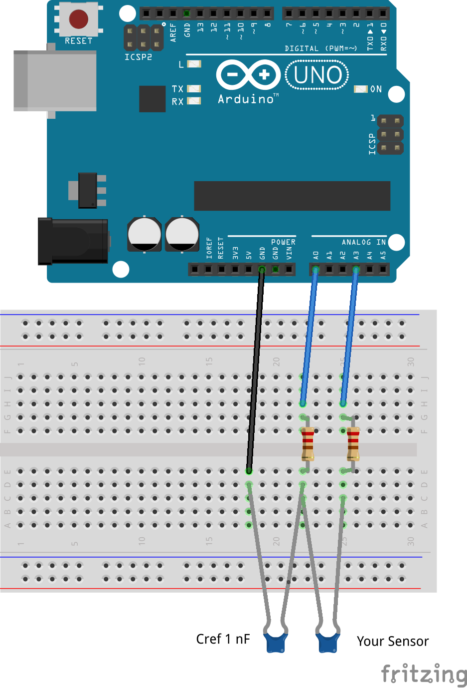

# 2. Maak een sensor met condensatoren

Vandaag ga je een sensor maken op basis van verandering van capaciteit. Wat de sensor gaat meten mag je als groep zelf beslissen. Aan het einde van de dag moet je een (filmpje van een) werkende sensor laten zien en (in dit notebook) een kalibratiegrafiek inleveren.

## Introductie

### Groep vormen

Deze opdracht doe je in groepen van 3 studenten. Je kan jouw groepsnummer en jouw medestudenten vinden op Brightspace onder Groups: ontwerpopdracht 2: ontwerp een sensor. Als eerste moet je je voorstellen aan jouw teamgenoten en zeker weten dat je met de juiste studenten aan de juiste tafel zit. Vervolgens download je [dit template notebook](DEFOntwerpopdracht2OntwerpEenSensorInvulTemplate.ipynb). Dit template moet aan het eind van de dag ingeleverd worden via Vocareum.
Als je groep om 10.50 niet compleet is, zet je stoplicht op rood. Wij komen dan kijken wie er mist en schuiven met studenten in incomplete groepen om jullie in volledige groepen te krijgen.

### Leerdoelen
De leerdoelen voor vandaag zijn (deze lijst komt uit de studiehandleiding):

1. Kennis hebben van gedrag van elektrische componenten en meetopstellingen
2. Het kunnen gebruiken van de eigenschappen van een elektrische component in een ontwerpproces om een fysische grootheid te meten.
3. Onderdelen van een datasheet zoals een kalibratiegrafiek (= grafiek op basis van testmetingen met een fit, die aangeeft welke waarde een sensor voor een bepaalde concentratie of temperatuur meet) opstellen, gevoeligheid en onzekerheid beschrijven
In tegenstelling tot vorige week geven we deze week niet expliciet aan welke cellen bij welke leerdoelen horen. Aan het einde van de dag kies je zelf welke cellen volgens jullie laat zien dat jullie bovenstaande leerdoelen onder de knie hebben.

### Caddy controleren op inhoud!
Je gaat vandaag werken met de apparatuur in de caddy die bij je tafel staat. Aan het einde van de dag controleert je TA of alles netjes in de caddy zit. Als er spullen missen hebben we een probleem! Controleer daarom voor je begint of alles in de caddy zit. Er ligt een lijst met wat er in zou moeten zitten bovenop je caddy.

**Als je dingen mist, of als je dingen te veel hebt, geef je dat direct aan bij je TA.**

### Samenwerken
Overleg bij alles wat je in het template invult met je team: wat je inlevert is van jullie alle drie. Je zal dus goed moeten samenwerken. Jullie hebben allemaal als het goed is de gehele opdracht doorgelezen. Maak nu samen een planning waarin je aangeeft
    
- hoe laat je bij de mijlpalen verwacht te zijn. Als je een mijlpaal niet haalt omdat je vast zit is het een goed idee om een TA om hulp te vragen
- Op welke tijden je als team je pauzes neemt: plan deze in! continue werken is niet effectief.
    
In de template staat een tabel. Vul deze in (en eventueel aan als je meer regels nodig hebt). **Laat de planning aan je TA zien, die tekent dit af!** De planning moet uiterlijk om **11.15** binnen zijn.


Hieronder begint de opdracht. Jullie keuzes in de ontwerpcyclus kunnen betekenen dat je zelf cellen toevoegd of verwijderd in de template. Dat is prima, zolang je ons maar laat zien welke ontwerpstappen je genomen hebt.
    
### Zo veel mogelijk laptops weg 
Als je iets in de template moet invullen dan heb je een laptop nodig, maar leg deze weg wanneer je dat niet hoef te doen. Je kan julle laptops nu weg doen tot het einde van sanity check 3.

## Voorbereiding: Sanity checks
Om zeker te weten dat al je apparatuur werkt doe je eerst een paar controles. Op Brightspace staat een powerpoint met een handleiding voor deze drie sanity checks. Deze handleiding ligt ook geprint op tafel.
    
### Sanity check 1: apparatuur in orde? 
Sluit de functiegenerator aan op de scope. Zie slides 1 tot en met 6 van de handleiding. Zet op de generator een 100 kHz, 16 Vpp (Volt peak-peak) golf en laat aan je TA zien dat je deze op de scope goed in beeld krijgt. Let op de assen, klopt het echt? 

**Laat dit zien aan je TA die tekent dit af.**
    
### Sanity check 2: bekende condensator meten 
Je gaat berekenen wat de capaciteit van je referentie-condensator is. Gebruik hierbij het volgende
    
- $V_{in}$ is een sinusvormig signaal met een amplitude van 8 V (16 Vpp) en een frequentie van 100 kHz
- De stroom door een condensator gegeven wordt door $I = C\frac{dV}{dt}$
- De stroom niet direct gemeten wordt, maar we met behulp van een shunt-weerstand van $1 k\Omega$ deze stroom omzetten in een voltage dat we meten.
    
Leidt hiermee op papier twee formules af: eentje waarmee je de capaciteit van de condensator bepaald wanneer je $V_{out}$ gemeten hebt en eentje andersom: waarmee je $V_{out}$ voorspelt als je de capaciteit weet. 
    
Als je beide formules hebt, dan sluit je vervolgens het plankje aan zoals uitgelegd in de handleiding, slides 6 tot en met 13. Als alle draden goed aangesloten zijn schroef je de referentie condensator die je gehad hebt in het plankje. Lees dan af wat de oscilloscoop meet. Bereken, op papier, op basis van wat je op de scope meet wat de capaciteit van je referentie condensator is.
    
**Laat je opstelling en je berekening op papier aan je TA zien, die tekent dit af!**
    
### Sanity check 3: Plaat condensator meten
Nu je de meetopstelling hebt getest doen we een laatste sanity check: kunnen we de waarde van een plaatcondensator voorspellen (berekenen) en daarna meten? Kijk welke materialen je beschikbaar hebt en ontwerp (op papier!) een plaatcondensator die een capaciteit heeft **van meer dan 50 pF**. Geef in je schets de belangrijke dimensies (maten) aan. Gebruik de plaatcondensator formule die jullie voor de online ontwerpopdracht condensator a afgeleid hebben wat de capaciteit van jullie condensator wordt:

Zet je berekening op hetzelfde papier als je ontwerpschets. Bouw vervolgens je plaatcondensator en sluit deze aan zoals de referentie condensator bij sanity check 2. Bereken de amplitude van $V_{out}$ die je op de osciloscoop verwacht te gaan zien. 
    
Meet op de oscilloscoop en gebruik de formules die je bij santiy check 2 afgeleidt hebt om de daadwerkelijke capaciteit van je plaatcondensator te bepalen.

**De cellen in de template bij *opdracht 1: sanity check 3* kunnen nu ingevuld worden. Bij de eerste python cell voeg je een formule in die op basis van de afmetingen en materiaal van de condensator uitrekent wat de capaciteit gaat zijn. Bij de tweede cell voorspel je, met hulp van die formule, wat de capaciteit van jullie condensator gaat zijn. Laat je plaatcondensator, je ontwerp en je berekening, allemaal in het template, aan je TA zien. Die tekent dit af.**


## Ontwerp opdracht: Maak je eigen sensor.
Na de sanity checks weet je nu hoe je een capaciteit meet en weet je hoe je de capaciteit van een plaatcondensator kan berekenen. Nu gaan we aan de echte ontwerpopdracht beginnen. De opdracht is:
    
**Maak een sensor die op basis van een verandering in capaciteit iets meet. Wat 'iets' is mag je zelf verzinnen.**
    
We gaan, via deze instructie, weer de ontwerpcyclus door om tot je sensor te komen.
    
### Synthese
In de formule van de vlakke plaat condensator staan drie parameters die je kan gebruiken in je ontwerp: afstand ($d$), oppervlakte ($A$) en diëlektrische constante ($\epsilon_{r}$). Deze parameters kan je door andere fysische grootheden laten veranderen. Zo zou je bijvoorbeeld een materiaal met een grote thermische expansie coefficient kunnen inklemmen tussen twee platen. Bij toename van de temperatuur worden de platen uit elkaar geduwd. Op die manier zorgt verandering in temperatuur voor verandering in afstand, dat via de capaciteit te meten is. Dit is een voorbeeld van een (vrij slechte!) temperatuur sensor. In de synthese fase ga je eerst ideeen ontwikkelen om vervolgens één idee te kiezen en uit te werken.
    
#### Opdracht synthese
Verzin als groep per parameter ($A$, $d$ en $\epsilon_{r}$) minsten één andere fysische grootheid die je via $A$, $d$ of $\epsilon_{r}$ kan meten. Schets hoe die drie sensoren eruit zouden moeten zien / zouden moeten werken. Upload je schetsen in de template bij opdracht 2. (Dus: drie schetsen in totaal als groep).

**Laat dat aan je TA zien.**

### Evaluatie
Kies één van je drie geschetste sensoren uit om daadwerkelijk te gaan maken. Bepaal je keuze op basis van de volgende criteria:
    
- wat is haalbaar gegeven de beschikbare materialen en tijd?
- wat vind je (als groep!) het leukst om te maken?

Vul nu bij Opdracht 3 in welke sensor jullie gaan maken.

## Simulatie
Het is belangrijk om van tevoren te weten of de sensor die je gaat maken zijn capaciteit in een groot genoeg meetbaar bereik veranderdt. Werk je schets van je gekozen sensor verder uit. Zet daar in ieder geval goed alle afmetingen bij. 
    
Als je schets klaar is, bepaal dan (schat, of leidt af) hoe de te meten variabele de variabele van de plaatcondensator beinvloed. 
    
Bijvoorbeeld: een stuk pvc tussen twee metalen platen van 10 cm bij 10 cm zal bij een temperatuur verandering van 20 naar 30 graden lineair uitzetten van 3 naar 3.002 millimeter. Hierdoor veranderd de capaciteit van 117.33 pF naar 117.25 pF. (ik heb expres een slecht voorbeeld gekozen, dit verschil is niet meetbaar).
    
Bereken en plot de verwachte ontwerpgrafiek van jullie sensor in de template bij opdracht 4. Maak daarbij gebruik van de functie die je zelf geschreven hebt bij sanity check 3. Zet met comments (#) duidelijk in je code welke aannames en schattingen je maakt.
   
Om te kijken of de verwachte verandering in capaciteit goed meetbaar is gebruiken we het pakket LTSpice. Dit pakket simuleert het gedrag van elektrische schakelingen. 

**Ieder groepslid opent op de eigen laptop LTSpice.**
    
- Open het bestand ```LTSpiceTemplateCapacitor.asc``` in LTSpice. (staat op Brightspace en [hier](LTSpiceTemplateCapacitor.asc)). 
- Run de simulatie (klik op rennende persoon icoon)
- Klik met rechtermuisknop in de lege grafiek die verschijnt en kies \add trace\ (of druk op A)
- Kies V(vin) en V(vout) en druk op ok. Je zou nu twee grafieken moeten zien.
- Verander de waarde van de condensator door er met de rechtermuisknop op te klikken. Een van de groepsleden kiest als waarde het midden van het verwachte bereik aan capaciteit (midden van je grafiek hierboven). De andere twee groepsleden kiezen het maximum en het minimum. 
- druk weer op 'run' en zie de grafieken veranderen. Lees af hoeveel Vpp LTSpice berekend bij de uitgang (Vout). Je kan de assen aanpassen door erop te klikken met je rechtermuisknop.
- Vul nu de tabel in deze staat in de template bij opdracht 5. 

**Elk groepslid heeft nu succesvol met LTSpice gewerkt, dit is belangrijk voor de ontwerpopdracht van volgende week**
    
Is de verwachte verandering in capaciteit goed meetbaar? Zo nee, ga dan terug in de ontwerp cyclus. Bepaal zelf hoe ver terug je moet stappen of vraag je TA om advies. 

**Is de verandering wel meetbaar, laat dan je ontwerpgrafiek en tabel aan je TA zien voor je verder gaat. Je TA tekent dit af. Deze grafiek moet voor de pauze af zijn!**

## Fabricage en meten (laptops weer weg)
Maak nu je sensor.
    
Zodra je sensor af is, maak je twee foto's van je sensor waarbij je in elke foto een andere meting doet. Probeer je scope scherm in beeld te krijgen zodat we ook de meetwaarde zien. Als dat door de opstelling niet kan, maar dan twee (extra) foto's van je scope die bij de metingen horen. Zet die foto's in de template bij opdracht 6. Dit zijn de foto's die we gebruiken om te zien of jullie sensoren werken. 

## Kalibratiemeting met Arduino
Sluit vervolgens je sensor aan op je Arduino (zie de schakeling hieronder) en upload de code die op Brightspace, of [hier](CapMeas_UNO_1r.ino), staat naar je Arduino. Je kan nu heel snel heel veel metingen doen van de capaciteit, veel sneller dan als je dat steeds op de scope moet aflezen.

<p>
  
</p>
    
Doe metingen over het bereik waar je de sensor voor ontworpen hebt (denk aan je berekende ontwerpgrafiek). Meet de bijbehorende capaciteit. Plot in de template bij opdracht 7 je gemeten kalibratiegrafiek. Plot in dezelfde figuur ook je verwachte kalibratie die je hierboven had uitgerekend.

**Laat je gemeten grafiek aan je TA zien en aftekenen!**

## Itereren
Bepaal aan de hand van je kalibratiegrafiek of je sensor goed is voor de gekozen grootheid. Kijk dan naar hoe de sensor nog verbeterd kan worden. Vul tekst in de template bij opdracht 8 aan.

Vervolgens kies je één van de twee en voer je de voorgestelde verbetering uit en kalibreer je je sensor opnieuw.

## Uiteindelijke resultaat
Zet in de template bij opdracht 9 een foto van je uiteindelijke sensor. Plot daaronder je kalibratiegrafiek, gemaakt op basis van je kalibratiemetingen. Fit een bijpassende lijn door je metingen. Zet in je plot ook je verwachte ontwerpgrafiek (op basis van je zelfgeschreven functie). 
   
## Conclusie
Schrijf een conclusie in de template bij opdracht 10. Benoem daar in minimaal:
    
- Is je sensor uiteindelijk geschikt om het fenomeen dat je wilde meten daadwerkelijk te meten? (Dat zou wel moeten, anders moet je nog verder itereren).
- heeft de verbetering uit de iteratie stap ook daadwerkelijk een verbetering opgeleverd?
- zit er (significant) verschil tussen je voorspelling van de ontwerpgrafiek en je uiteindelijk gemeten kalibratiegrafiek? Kan je dat verschil verklaren?
- klopt de vlakke plaat formule genoeg voor jullie specifieke sensor? 
    
**Laat deze conclusie door je TA lezen en aftekenen!**
   
## Aantonen leerdoelen beheersing

Je hebt vandaag gewerkt aan het onder de knie krijgen van de volgende leerdoelen:   

1. Het kunnen gebruiken van de eigenschappen van een elektrische component in een ontwerpproces om een fysische grootheid te meten. 
2. Kennis hebben van gedrag van elektrische componenten en meetopstellingen.
3. Onderdelen van een datasheet zoals een kalibratiegrafiek opstellen, gevoeligheid en onzekerheid beschrijven.

Als het goed is laat je werk in het template zien dat je deze leerdoelen nu beheert. Het is aan jullie om zelf aan te geven welke cellen van de template bij welk leerdoel horen. Kopier deze cellen bij opdracht 11. Lees het template door, kijk goed naar de cellen met LEERDOEL in de titel. Kopieer deze cellen en zet ze bij het juiste leerdoel in het template bij *..*.

## Inleveren op Vocareum
Je bent nu klaar met het invul template en kan deze op vocareum inleveren. 

- Open Vocareum via de link op Brightspace. 
- Nodig je groepsgenoten uit
- Upload je notebook en alle foto's naar vocareum via de 'upload' knop.
- Open je notebook in Vocareum
- **Klik boven op Kernel -> Restart and Run all**
- Check of er geen errors in je python zijn
- check of je afbeeldingen niet (per ongeluk) als "attachment" erin staan, dus dubbelklik op alle afbeeldingen om dit te checken. Als dit wel het geval is, haal je TA er bij en druk niet op submit!
- Als je helemaal klaar bent kan het notebook worden ingeleverd door bovenaan op **submit** te klikken. Je kan meerdere keren iets inleveren en alleen de laatste versie wordt bewaard. **druk na submit op *end lab* voordat je vocareum afsluit! Anders kunnen wij niet nakijken!** Na de deadline is het niet meer mogelijk om in te leveren.

## Feedback op samenwerken geven
Kijk als herinnering nog even de video over feedback geven: https://www.youtube.com/watch?v=16uW1kPoiww. Pak je logboek van vorige week erbij en geef elkaar allemaal feedback. Noteer je feedback in je logboek.

Verder levert elke student individueel het feedback logboek in. Ook hiervoor is de deadline 17.30. Let op dat je deze inlevert bij de assignment van de huidige ontwerpopdracht.

## Opruimen en aftekenen
Zodra alles ingeleverd is ruim je de tafel op. Zorg dat alles spullen die in de caddy horen daar weer netjes terug gelegd worden (zie de lijst bovenop de caddy!). 

**Als je klaar bent met opruimen laat je je tafel aan je TA zien. Je TA geeft je toestemming om weg te gaan als alles netjes is.**


   
