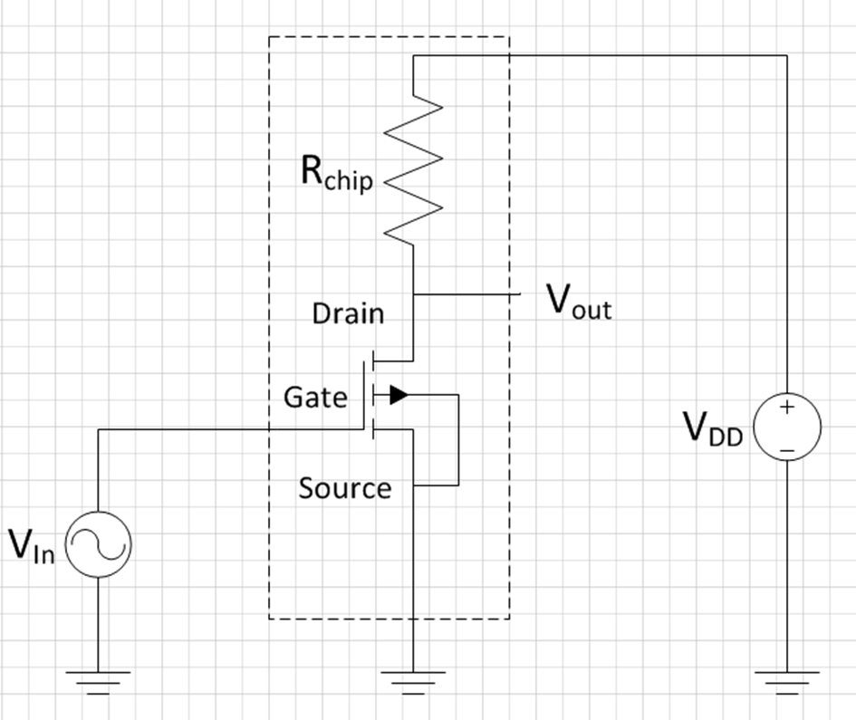
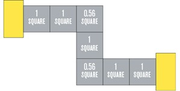
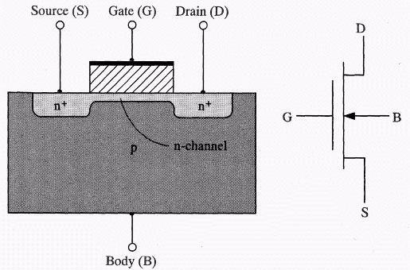
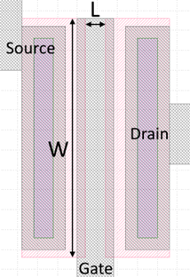
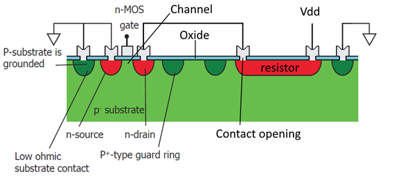

# 3. Ontwerp een transistor

## Introduction

In this assignment, you will design, on a single chip, a two components integrated circuit consisting of a transistor and a resistor. You will first have to simulate the circuit in the computer program “LTSpice” to obtain the required behavior and component values. After this, the lay-out of the devices must be drawn in another computer program: “KLayout”. Based on this lay-out, chips will be fabricated with the dimensions you designed.

Figure 1: Electrical circuit for design assignment. The components in the dashed box will be your integrated circuit. The voltage sources are for power and supplying the input signal. Later on in the LTSpice simulation circuit, additional parasitic components are added to account for the pad and wire capacitances.

Figure 1 shows the electrical circuit you will be working with. It consists of a transistor (labelled NMOS1 in LTSPICE) and a resistor called $R_{Chip}$. Two voltages sources are added for the power supply ($V_{DD}$) and input voltage ($V_{in}$­), $V_{out}$ is the output voltage which will go to the oscilloscope when you measure the device after fabrication.

By applying a voltage on the input (gate), the resistance between the drain and source will be modulated. Due to this a current going from drain to source will be modulated. A minimum voltage is required to form a channel between source and drain, which is called the threshold voltage ($V_{Th}$). For voltages above $V_{Th}$ the transistor will form a conductive path between source and drain. As the gate is electrically isolated from the source and drain by 100 nm of $SiO_2$, ideally no current will flow from the gate to the source or drain. Remember that since current is a flow of charged particles, which are electrons with a negative charge, the charge carriers move from source to drain. Hence their names.

For a current to flow from the drain to the source, a so-called drain-source voltage must be applied. This could be done by connecting the source to a voltage supply, however, in such a case the output voltage of the transistor will always be 5 V and only the current is modulated by the gate voltage. If we want to make a circuit where an input voltage on the gate controls an output voltage ($V_{out}$) on the drain of the transistor, we need to add a resistor between the drain and the power supply, as shown in figure 1.

As the transistor between the drain and source has a finite resistance, which is controlled by the gate, we now end up with this transistor resistor in series with the on-chip resistor $R_{chip}$. This acts as a so-called voltage divider: the voltage at $V_{out}$ equals the current which goes to through $R_{Chip}$ and the transistor, times the on resistance of the transistor. Mathematically:

$V_{out} = \frac{R_{Transistor}}{R_{Transistor} + R_{chip}} V_{dd}$

Since the resistance value of the transistor depends on the applied input voltage $V_{in}$ we get that we can control $V_{out}$ with $V_{in}$: 

$V_{out}\left(V_{in}\right) = \frac{R_{Transistor}\left(V_{in}\right)}{R_{Transistor}\left(V_{in}\right) + R_{chip}} V_{dd}$
 
Both the exact value of $R_{Chip}$ as well as the behavior of the transistor is determined by their physical dimensions on the chip. Those dimensions you get to design today! Below we will explain seperatly for the resistor and the transistor how the design links to their resistance value. This is treated in the lecture and repeated here for your convenience. 

### CMOS resistor on chip
We will create a resistor on the chip by just making a suitably long strip of material that conducts electricity. We could use the top layer of aluminium, but as our aluminium ($Al$) has a very low resistivity ($2.8×10^{-8}$ Ω-m), making a resistor of $Al$ with a value of several kΩ would either require a very thin or very long resistor. This is not practical; however, it is also possible to use doped $Si$ as a resistor. A region doped with another type of implants as the substrate will formed a depletion region between the doped area and the substrate. When biased correctly this will act as a diode between the doped region and the substrate, therefore insulating the implanted region from the surrounding $Si$.
We will use the SN region as resistor, which is a n-type region surrounded by the p-type substrate. Hence a diode is formed between the SN and the substrate, which remains reverse biased if the substrate has a lower potential than the SN region. Therefore, the substrate must be grounded. We will create a beam shaped resistor. Remember from high school that for a beam:

$R = \rho_{s}\frac{l}{b d} $

where $R$ is the resistance, $\rho_{s}$ is the specific resistance which depends on the material, $l$ is the length (in the direction of the current) and $b d$ is the area (perpendicular to the current), with $b$ the width of the beam and $d$ the depth. On our chip, how deep the $Si$ is doped and with how many doped atoms per volume is determined by the factory. This means that for the resistor on the chip, the factory controls $\rho_{s}$ and $d$. As a designer, you can control the length and the width. Seperating what we control:

$R_{Chip} = \frac{l}{b}\frac{\rho_{s}}{d}$

The part we don't control we call $R_{S}$ and is provided by the factory. The SN in our process has a typical $R_S$ of $60$ Ω.

Note that the resistance is determined by the ratio of $l$ over $b$, not by the absolute values. Without loss of generality we can write the length as a number of times the with: $l = nb$. This gives 

$R_{Chip} = nR_{S}$

With $n$ the amount of times that the width fits in the length. This makes it easy to translate geometry into total resistance through RS: just count the number of squares (of width $b$ in a line. For instance, a 5 µm wide and 25 µm long line consists of five 5x5 µm squares, therefore $R = 5 R_S$. This is especially useful when a meandering resistor is used to reduce the area of $Si$ required for the resistor. However, as shown in the figure below, the corners of a meandering resistor must be counted as 0.56 square. This is because of current-crowding effects at the corner.



You can use any shape and dimensions to draw your resistor to match the value used in the simulation if it follows the design rules in the next section. The SP guard ring should also follow the meandering structure for best performance of the device and enclose the entire resistor, as shown in the template. The length of the resistor is typically defined from CO to CO.


### CMOS transistor on chip

For the transistor: see the figure below for a typical cut-through of the inside of a MOSFET transistor. Between two areas of well conductive doped $Si$ (S and D) we create a small channel of badly conducting $Si$ that is not doped. On top of this channel, seperated by an insulator, a piece of well conductive metal is applied called the gate (G). When a voltage is applied to the gate, the charge on the gate either pushed away electrons in the channel, increasing the resistance between S and D, or attracts electrons, lowering the resistance  



The value of $R_{Transistor}$ depends on its operation region and its dimensions W and L. Here W is the width of the channel and L the length of the channel. In the figure above L is the distance between the S and D regions, W is invisibile in this view (points outside of the image). In general, a wider and/or narrower transistor has a lower on-resistance.

The resistance can also be estimated. In the saturation regime (relevant for digital assignment below):

$R_{Transistor} = \frac{1}{\mu_n C_{ox} \frac{W}{L}(V_{GS} - V_{Th})} = \frac{L}{\mu_n C_{ox} W(V_{GS} - V_{Th})}$ (3) 

While in the linear regime (relevant for analog assignment below):

$R_{Transistor} = \frac{1}{\mu_n C_{ox} \frac{W}{L} V_{DS}} = \frac{L}{\mu_n C_{ox} W V_{DS}}$(4)

Where $µ_n$­ is the mobility of electrons in $Si$ (596 $cm^2 \text{/} Vs$ in our model), $C_{ox}$ the capacitance per unit area of the 100 nm thick gate-oxide, and $V_{Th}$ the threshold voltage ($1.1 ± 0.1$ V). These are process-depended and cannot be controlled by the designer (which is you in this assignment). Only the W and L can be changed, within the specifications of the design rules as mentioned in the KLayout manual. In the digital assignment the relevant $V_{GS}$ are 0V and 5V, in the analog assignment you can assume VDS is typically between 2-3 V with an uncertainty of about 1 mV

The transistor as you will see it in KLayout is shown in the following figure, in which the length (L) and width (W) are indicated. Note that the L is the distance between the two implanted SN regions and not the width of the gate for our process! These dimensions can be changed into the L and W used in LTSpice, if they abide to the design rules described in the next sections. Don’t forget that beside the SN-layer, all other masks will also have to be resized to match!



### CMOS: Layers

In lithography designs masks are used to imprint (dope, etch, etc.) the intended design into or onto the wafer. The mask will be used to imprint the pattern into a photoresist layer during fabrication, which is subsequently used to pattern the layer that is currently being worked on. For this design assignment you will have to design four masks based on a provided template. The layers that will have to be designed are:
1.	SN, shallow n-type $Si$. It is used for the resistor and source and drain areas of the transistor. This is a high dose but low energy (hence shallow) Arsenic implanted region in the $Si$.
2.	SP, shallow p-type $Si$. It is used to electrically insulate the devices from the surrounding substrate, the so-called guard ring, and to bias the substrate to ground. This is a high dose but low energy (hence shallow) Boron implanted region in the $Si$.
3.	CO, contact opening. After the implantations, the $SiO_2$ gate oxide to realize the MOS capacitor (metal-oxide-silicon) is formed on the wafer. As $SiO_2$ is non-conductive we must make holes in this layer in the areas where we want to contact the $Si$.
4.	IC, interconnect. The last step in the process is to deposit and pattern aluminium on the wafer to be able to electrically contact the $Si$ transistor and on-chip resistor from the outside.

The following figure shows a cross-section on the transistor (left) and resistor (right) as it will be made in the top surface of the $Si$ is shown. The actual devices are only in the first few hundred of nm of the $Si$, the rest of the wafer is for mechanical stability.



## Choose an assignment
As a group, you can choose between two design assignments: either a digital signal inverter (‘not gate’) can be made or an audio amplifier. First, you will simulate the design you chose in LTSpice, after this, you will translate it into a lay-out using KLayout.

Read the two assignments below. As a team, choose which one you want to work on today. 

### Assignment option 1: digital inverter
A digital inverter gives a high output when the input is low, and vice versa, and is the basic building block of any digital circuit. Here the transistor acts like a switch with a finite on-resistance. The goal of the assignment is to have a circuit that can invert a 20 kHz square wave as good as possible. This means that when 0 V is supplied to the gate the output should be close to 5 V, and when 5 V is supplied it should be close to 0 V.

*Your design assignment is to make a chip where you adjust the width and length of the transistor, and the value of $R_{Chip}$ in such a way that the inverter reaches the required voltages as close as possible, but at least within 250 mV of the nominal value of 0 or 5 V at the end of each pulse.*

*When you get your own chip, you will have to show that this works!*

### Assignment option 2: audio amplifier
The circuit can also be used as an audio amplifier, for instance, to amplify the signal coming from a microphone. In this case, a small changing voltage is supplied to the gate, which is amplified at the output. The goal is to design an amplifier which can amplify a sine input by at least a factor 4, which means that the amplitude of the output voltage must be at least four times the amplitude of the input voltage.

*Your design assignment is to make a chip where you scale the DC offset voltage of the source, the $R_{Chip}$ resistor, and the transistor dimensions in such a way that the gain of the circuit is at least 4 times the amplitude of the input signal (AC gain).*

*When you get your own chip, you will have to show that this works!*

Make your choice of assignment and let your TA know your choice. You will get a form from your TA based on your choice.

## Part one: simulations
### Warm-up: contact pad capacitance
In both versions of the assignment (described below) you will have to consider that the 1 by 1 mm contact pads on your chip will have a capacitance that is not neglectable. Remember the assignment from last week and realize that the contact pads together with the grounded bottom of the chip can be considered as 1 by 1 mm plate capacitors with 100 nm silicon dioxide as isolating material. Calculate what the capacitance of the contact pads is. You will need to put the value that you’ve calculated in the relevant elements of the LTSpice simulation later on.

### Tolerances

First, using what you learned in the lecture on tolerances last Monday and the equations given above, we will look at the uncertainty in designing the resistor. A source of variation in our process is the sheet resistance ($R_s$­) of the resistor, which strongly depends on the implantation dose and annealing temperature. In our process, the sheet resistance can vary ±10%. Suppose we want the make sure the uncertainty in the value of $R_{Chip}$ is less than 11%: how accurate (as a percentage) do we have to count the number of 'blocks' we design on the chip? 

Since the uncertainty in $R_{Chip}$ will be at least 10%, an additional uncertainty in $R_{Transistor}$ of less than 5% is neglectable on the final output $V_{out}$. Use that any dimensions on the chip can vary due to fluctuations in the exposure energy or resist thickness. For the The maximum absolute variation this can give is ± 200 nm of the designed dimensions. This holds for both W and L of the transistor. Use the equation for the lineair regime. Derive what the minimal values of W and L are to make sure that the uncertainty in $R_{Transistor}$ is less than 5%. 

### Thinking physics
On the sheet your TA gave you is a table with “problem -> cause -> solution”, where problem is already filled in. Given all the above information you should be able to analyse what you should do if you encounter these problems. **Fill in this table and show it to your TA.**

### Simulate in LTSpice

*Now you can move on to simulating in LTSpice, but before simulating, first, read the LTSpice manual!*

Open the file in LTSpice associated with your chosen assignment:

- Assignment option 1: digital inverter should open ```digital NMOS_EKL_digital_template_group_XYZ.asc```
- Assignment option 2: audio amplifier should open ```Template: NMOS_EKL_analog_template_group_XYZ.asc```

Now do the following things (in order)

1. The capacitors that represent the contact pads don't have a values assigned to them. Right click on the capacitor icon (not on the label). In the window that pops up, add the value for the capacitance of the contact pads you calculate before. Don't forget the unit pre-fix! (most likely 'p' for pico-Farad. If you calculated 10 pF, you type 10p). Do this for all the capacitors that represent contact pads.
2. Now click on the running man (version 17) or "play button" (version 24). An empty graph window should appear.
3. Add lines for Vin and Vout ("add traces", shortkey in version 17: A)

You should now see your first simulation result for the default values we provided in the template. Now you can start your actual first part of the design:

1. Change the value of the resistor by right clicking on the resistor icon
2. Change the value of the width (W) and length (L) of the transistor channel by right clicking on the transistor icon
3. If you are doing the analog amplifier (assignment 2), you can also change the dc-offset of the input signal: right click on the $V_{in}$ icon.
3. Run the simulation again by clicking on the running man or play button.

Do not change the values without thinking: use your problem -> cause -> solution to guide you. Keep on changing the values of your resistor and transistor until your simulation show result which satisfy the requirements of your chosen assignment. You have to draw a graph of this on your sheet. You can draw with pencil and highlight the important parts, or you can print what is on your screen and glue on the sheet. Once you have a good design, there are two things to check:

1. The dimensions on the chip can vary due to fluctuations in the exposure energy or resist thickness as you have calculated above. Before drawing the lay-out it is good practice to check the tolerances of your circuit. Simulate the impact of these variations on your circuit. If the factory reaches the edges of the specified variations, will your circuit still satisfy the criteria of the design?
2. For both system we want to know: do they still work with a higher frequency of $V_{in}$? To change this, right click on $V_{in}$. For the digital assignment you have to specify the on-time and off-time of the square wave. For the analog assignment you can specify the frequency in Hz. You have to draw a graph of this on your sheet.

Once you have this working you should try to improve the performance of your chip using the below steps, which differ per assignment:

#### improvements assignment 1: digital invertor
1. The power consumption when the transistor is on can be quite high. This is undesired behavior and can be reduced by optimizing the W/L and $R_{Chip}$ values. Add the power dissipated by $R_{Chip}$ (remember, $P = U∙I$) to the simulation window and try to reduce the power consumption in the on-state ($V_{in}$ = 5 V) to below 2.0 mW without sacrificing the previous specification. The maximum allowed dissipation is 3.0 mW.
2. Optional (if time permits): Digital circuits are fast! Try to determine the maximum frequency your circuit can operate at while still coming within 500 mV of the desired value at the end of the pulse. Can you improve your circuit to increase this maximum frequency? What happens to your power consumption? 
3. The dimensions on the chip can vary due to fluctuations in the exposure energy or resist thickness as you have calculated above. Before moving on to drawing the lay-out it is good practice to check the tolerances of your circuit. Simulate the impact of these variations on your circuit. If the factory reaches the edges of the specified variations, will your circuit still satisfy the criteria of the design?


#### improvements assignment 2: analog amplifier
1. Optimize the system such that it is also a good (at least 4 x) amplifier for higher frequencies. Try to get the biggest spread (ie. bandwith) of frequencies for which your amplifier works. Ideally at least 4x gain at 20 kHz for audio, but see if you can get it as high as 100 kHz. 
2. Optional (only if time permits) Explore for which amplitudes of the sine at the input the amplifier still gives a correct output, that is no distortion takes place. To analyze distortion, you can use the Fourier transform in the simulator: right-click the plot – View and select FFT. Now select the input and output signal. For an undistorted signal you should only see a peak at 1 kHz, once the signal starts to be deformed by the circuit additional peaks at higher frequencies will appear. Try to obtain a circuit which can at least process a sine with 0.2 V as amplitude for Vin with less than -20 dB distortion (= difference in dB between the fundamental frequency of 1 kHz and its first harmonic).

*You have to write down details from your LTSpice simulation, including some graphs, on your sheet and show this to your TA before moving on the phase two: Layout.*

## Phase two: lay-out
Now that you obtained an integrated circuit that meets the specification it is time to translate this into a physical lay-out. For this KLayout will be used. First do the following steps:

1. Get the KLayout Manual
2. very closely follow the steps under ```Start-up and changing the group name```
3. Read the Design rules. If you don't understand a design rule, ask your TA.
4. Read the KLayout manual completely
5. start editing. Tip: start with the SN layer of the resistor

*When done editing perform the design-rule check. When all your design rules are ok, ask another group to check your design rules. They have to sign your physical checklist on your sheet!* Any mistakes in the layout will be your own responsibility and that of the group which checked your design: they will not be checked before submitting them to the mask manufacturer. The final lay-out and LTSpice design will have to be submitted on Brightspace to get it fabricated.

## What to show to your TA during the day?
1. Your derived equation and related uncertainties
2. Your simulation in LTSpice before moving on to designing your layout in KLayout

## What to physically hand in?
The form that is on your table which includes:
1. A graph / figure describing the behavior of your designed chip
2. A design rules check done by another group of students (and signed by them!)

## What to digitally hand in on Brightspace?

1. Your final design template for LTSpice (*.asc), with your group number in the filename instead of the XYZ
2. Your final KLayout design file (*.gds), with your group number in the filename instead of the XYZ
