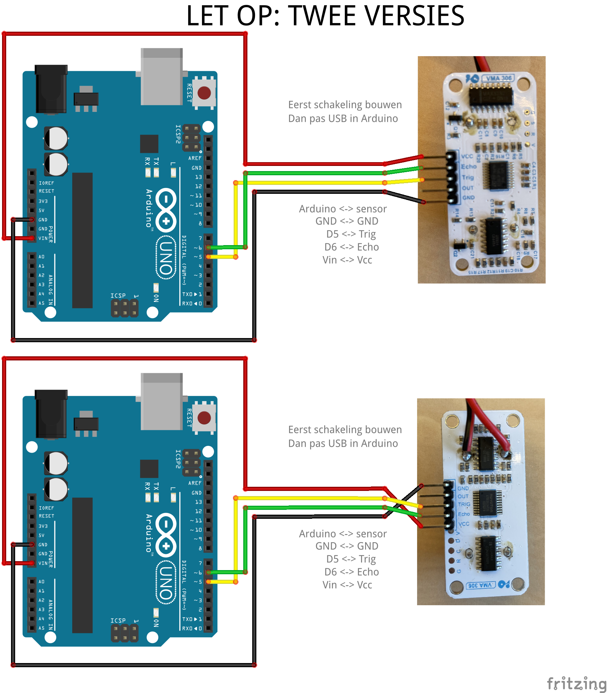
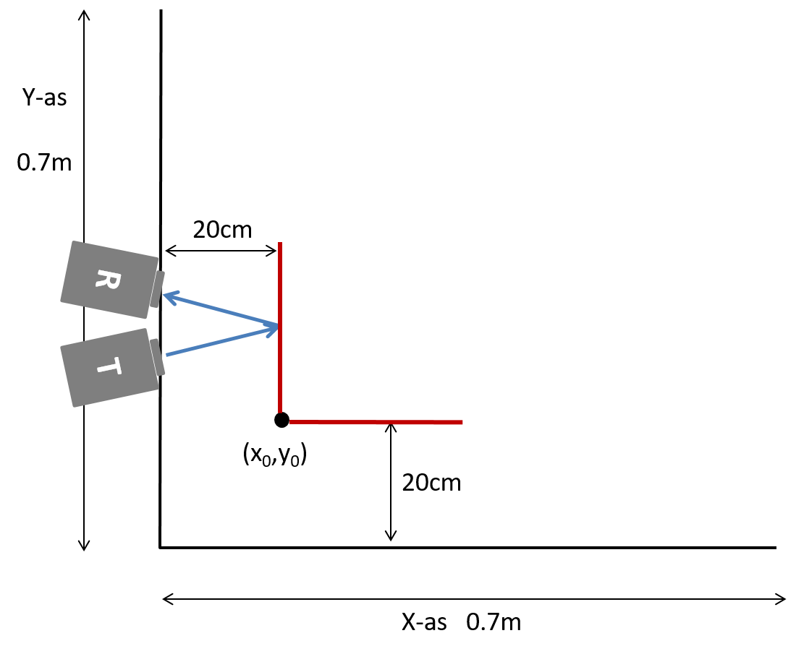

# 4. Echo akoestisch algoritme
Vandaag ga je zelf een algoritme ontwerpen waarmee je de locatie van een object op basis van echo's gaat bepalen.
Dit document helpt je daar stap voor stap doorheen. Lees dit vooraf goed door zodat je weet wat er vandaag van je verwacht wordt.

## Introductie 

### Leerdoel
De leerdoelen van vandaag zijn: 

- Inzien dat het maken van een algoritme een ontwerpproces
- De ontwerpcyclus optimaal inrichten op de randvoorwaarden van de ontwerpopdracht

Aan het einde van de dag laat je zien dat je dit leerdoel onder de knie hebt door relevant zaken aan te leveren. Daarbij gebruik je [dit](DEFOntwerpopdrachtAlgoritmeInvulTemplate.ipynb) template wat je gedurende de dag invult.

### Groep aanmelden 
Deze opdracht doe je in groepen van 3 studenten. Je kan je groepsnummer en je medestudenten vinden op Brightspace onder Groups: ontwerpopdracht 4: maak een algoritme. Vervolgens ga je naar de juiste opdracht in vocareum (link op brightspace) en geef je hier met de knop 'Send Invite' je groepsgenoten aan zodat jullie gezamenlijk in dezelfde notebook kunnen werken. Start de opdracht nog niet! Dat doe je pas aan het einde van de dag als je klaar bent om in te leveren. Uiteindelijk lever je het ingevulde template als groep in via vocareum.

Als je groep om 11:00 niet compleet is, trek dan aan de bel je TA erbij te roepen (gebruik je stoplicht). Wij komen dan kijken wie er mist en schuiven met studenten in incomplete groepen om jullie in volledige groepen te krijgen.

### Samenwerken
Overleg bij alles wat je in het template invult met je team: wat je inlevert is van jullie alle drie. Je zal dus goed moeten samenwerken. Jullie hebben allemaal als het goed is dit hele document doorgelezen. Maak nu samen een planning waarin je aangeeft

- Hoe laat je bij de mijlpalen verwacht te zijn. Als je een mijlpaal niet haalt omdat je vast zit is het een goed idee om je TA om hulp te vragen
- Op welke tijden je als team niet met de opdracht bezig gaat zijn (je pauzes, plan deze in! continue werken is niet effectief)

Vul de planning tabel in bij *opdracht 1* in het template. 
*Laat de planning aan je TA zien om deze te controleren. De planning moet uiterlijk om 11.00 gezien zijn*.

### Schermen: max twee laptops, geen AI (chat-GPT)
Vandaag werk je op als team van drie met twee laptops en één fysiek notebook. 

- Op één van de laptops draait het python template. 
- Op de andere laptop sluit je de Arduino aan
- Het fysieke notebook gebruik je als labjournaal om notities in te zetten en metingen te noteren.

We willen geen enkele andere applicatie of website op de laptop (of telefoon) schermen zien vandaag: dat leidt af van de opdracht. Bij deze opdracht is het gebruik van AI zoals chat-GPT nadrukkelijk verboden. Ten eerste omdat je bij deze opdracht het leerdoel is te laten zien dat je zelf een algoritme kan ontwerpen. Ten tweede omdat de ervaring leert dat chat-GPT bij deze opdracht hele verkeerde antwoorden geeft die teams urenlang de verkeerde kant op kunnen sturen. Mochten we chat-GPT of een andere AI tool op je scherm actief zien dan beschouwen we dat als *afkijken*, dus niet zelf de leerdoelen willen leren, met de standaard bijbehorende gevolgen: niet meer aan DEF deelnemen.

## Voorbereiding, werkruimte inrichten, benodigd materiaal.

Download de volgende bestanden naar één van jullie laptops. Zorg dat deze in dezelfde map op je laptop staan:

- [het template (een Jupyter notebook)](DEFOntwerpopdrachtAlgoritmeInvulTemplate.ipynb)
- [een library voor beeldvorming](imagingDEF2024.py)

Run de python cel onder *opdracht 2* in de template om alle benodigde libraries te laden. Mogelijk voeg je er zelf nog een aantal toe later vandaag. Als dit een error geeft, roep dan je TA erbij.

Je hebt een leeg oppervlak van (minstens) 70 cm bij 70 cm nodig. Op de tafels hebben we een assenstelsel aangebracht. Daarnaast heb je nodig:

- Stuk gevouwen A3 papier, hoe steviger het papier hoe beter. Staat al op je tafel.
- Je Arduino, met daarop aangesloten de akoestische sensor, die in je zelfgemaakte houder zit. Zie hieronder voor de schakeling waarmee je de Arduino aansluit op de sensor.
- Een telefoon of andere camera om foto's van je opstelling te maken. Voeg, waar nodig, een korte beschrijving toe om toe te lichten wat we zien op de foto

Sluit je Arduino aan volgens deze schakeling, zorg ervoor dat je USB kabel niet in je laptop zit terwijl je de schakeling aansluit!



### Stap 1: Kalibreren sensor 

Upload de code ```distanceCalibration.ino``` die op Brightspace en [hier](distanceCalibration/distanceCalibration.ino) staat naar je Arduino. Open vervolgens de ```Serial Monitor``` op je laptop. Je ziet nu de ruwe meetwaarden van je sensor binnenkomen. In het college  is uitgelegd wat deze waardes betekenen.

Doe een serie metingen om je sensor te kalibreren. Bepaal zelf geschikte afstanden waarop je zender, ontvanger en reflector neerzet. Gebruik het meetlint van één van de assen op je tafel om de afstand te bepalen. Noteer je metingen in je fysieke notebook zoals je geleerd is bij het practicum. Verwerk jullie metingen bij *opdracht 3* in de template. Bepaal zelf welk verband het beste je metingen beschrijft en fit de bijpassende functie.

***Let erop dat je totale afgelegde afstand van het geluid gebruikt, dus 'heen en terug'***

Maak ook een foto van je kalibratieopstelling en voeg deze in bij *opdracht 3* in de template. 

### Zet kalibratie resultaat in Arduino
Open vervolgens de Arduino code ```distanceMeasurement.ino``` die op Brightspace en [hier](distanceMeasurement/distanceMeasurement.ino) staat. Pas deze code aan zodat je eigen kalibratie constanten erin staan. Upload vervolgens deze code naar je Arduino. Jullie hebben nu zelf jullie sensor gekalibreerd en bent klaar voor het volgende deel van de opdracht.
   
### Opdracht 2: Testen meetopstelling
 We hebben op elke tafel een assenstelsen aangebracht met papieren linialen. We gebruiken de notatie (x,y) in centimeters, bijvoorbeeld (0,40) is het punt 40 cm op de y-as, en (35,35) is in het midden van je oppervlak.
 
 Jullie gaan 7 metingen doen om het imaging algoritme te testen. 
 Zet het papier met de vouw op (20,20) en met een hoek van 90 graden.
 Zie onderstaande figuur.
 
 
 
 Doe metingen met je bron en ontvanger op de volgende posities. Noteer de totaal afgelegde afstand van het geluid zoals je Arduino die meet. Noteer je resultaten in je fysieke notebook. Als je al je metingen hebt vol je deze in bij *opdracht 4* in het template.
 - bron (0,40), ontvanger (0,30)
 - bron (0,30), ontvanger (0,20)
 - bron (0,10), ontvanger (0,20)
 - bron (40,0), ontvanger (30,0)
 - bron (30,0), ontvanger (20,0)
 - bron (10,0), ontvanger (20,0)
 - bron (10,0), ontvanger (0,10)

Dit moet nu een uitkomst opleveren dichtbij de verwachte waarden: x0=20 cm y0=20 cm alpha=0 graden, beta=0 graden met kleine std. dev.

Laat dit zien aan je TA. **De deadline hiervoor is 12.00 PM. Als het voor die tijd niet gelukt is komen we kijken wat er mis gaat en hoe we jullie kunnen helpen.**
 
## Ontwerp individueel algoritme
Hieronder doorloop je de stappen van de ontwerp-cyclus.

Nu bedenkt elke student, individueel, een eerste algortime. Voor veel groepen komt dit ongeveer overeen met de lunchpauze: je kan dus in de pauze nadenken over je algortime. Beschrijf jullie algoritmen visueel (blokkenschema) op een A3 zodat je mede studenten (en docenten) snappen hoe je algoritme werkt. 

In sommige gevallen (uitzonderingen) zal je wat python code willen schrijven voor je algoritme. Doe dit op de laptop waar je ook het template draait en sla je python code op in het template, niet in een aparte file.

Ten slotte voer je je algoritme uit om te kijken of het daadwerkelijk werkt. 

Daarna ga je als 1e iteratie de beste ideeen van de verschillende algoritmes combineren tot één nieuw algoritme. "

## Iteratie 0: Eerste pogingen
### Synthese
Beschrijf bij *opdracht 5* in de template jullie algoritmes. Voeg foto's van gemaakte schetsen in.

### Simulatie 
Overleg als groep welke algoritme je kansrijk acht om goed te gaan werken. Kies minstens twee, mogelijk alle drie, de algoritme om te testen. Hou er rekening mee dat metingen doen en verwerken tijd kost, dus werk snel. Kies als groep zelf een combinatie van x0, y0, alpha en beta. Zet het reflectie-paper op deze zelf gekozen positie en voer één voor één minimaal twee van de drie algoritmes uit. Dat levert een hele reeks aan meetgegevens op die je bij *opdracht 6* in de template invult.

**Alleen de metingen die een bruikbare waarde opgeven kun je in de data array in de volgende stap toevoegen. De rest van de metingen kan niet gebruikt worden door het imagingDEF programma en moet je dus met een ```#``` commentarieren. **

Hieronder staat een voorbeeld van hoe dat eruit kan zien voor een groep van drie studenten geboren in de jaren 1980 genaamd "Rolf", "Eric" en "Rutger" (verrassing...). De data in dit voorbeeld is verzonnen. De tweede en zesde meting van Rolf leverde in dit voorbeeld een ongeldige waarde op. Erik had een algoritme waar maar twee metingen uit kwamen (onmogelijk) en Rutger had bij Rolf afgekeken qua algoritme (ook niet slim).

```pyton
data ={'Rolf' :  pd.DataFrame(columns=["xs", "ys", "xr", "yr", "R"], data=[
    [0,40,0,30,81.0],
    # [0,30,0,20,ongeldig],
    [0,10,0,20,25.5],
    [40,0,30,0,57.1],
    [30,0,20,0,35.8],
    # [10,0,20,0,ongeldig],
    [10,0,0,10,17.0]    
    ]),
       'Eric' : pd.DataFrame(columns=["xs", "ys", "xr", "yr", "R"], data=[
    [0,40,0,30,85.0],
    # [0,30,0,20,ongeldig],
     ]),
       'Rutger' : pd.DataFrame(columns=["xs", "ys", "xr", "yr", "R"], data=[
     [0,40,0,30,82.1],
    # [0,30,0,20,ongeldig],
    [0,10,0,20,23.5],
    [40,0,30,0,55.1],
    [30,0,20,0,31.8],
    # [10,0,20,0,ongeldig],
    [10,0,0,10,11.1]    
    ])
    }
```

### Evaluatie
Run de cellen onder *opdracht 7* in de template om de evaluatie uit te kunnen voeren. 

## Iteratie 1+
### Synthese
Maak als groep één nieuwe blokkenschema op A3 van wat je nu als algoritme gaat proberen. Als het kleine wijzigingen zijn ten opzichte van een vorige iteratie, kras dan gewoon in de oude blokkenschema als dat duidelijk blijft. Maak een foto en zet die bij *opdracht 8* van de template. Zorg dat het iteratienummer goed op de foto te zien is.

### Simulatie en evaluatie
Je gaat nu weer metingen doen om je algoritme te controleren. Kies een nieuwe target plek en hoek waar je het papiertje neerzet. We raden je aan om minstens twee meetseries te doen met verschillende locaties. Deze meetseries kunnen verwerkt worden bij *opdracht 9* in de template.

### Decision
Is je algoritme goed genoeg, of valt er nog wat te verbeteren? Voldoet het aan de eisen (1 cm en 5 graden?). Kan je het aantal benodigde metingen nog omlaag brengen? Als je algoritme nog verbeteringen nodig heeft, kopieer cellen vanaf opdracht 8 en 9. Plaats deze onder opdracht 9 in de template en maak daarin de volgende iteratie. 

Is je algoritme klaar dan ga je hieronder door.

## Algoritme aan TA laten zien
Hierboven heb je als het goed is een aantal keren ge-itereerd.
**Als je tevreden bent met je algoritme roep je je TA erbij en laat deze meekijken met de laatste versie van je algoritme. Als je TA tevreden is met jullie algoritme krijg je van je TA een locaties voor het papier voor de uiteindelijke test.**
Doe metingen op deze locatie en voer je algortime voor de laatste keer uit. Gebruik hier bij *Opdracht 10* in de template.

## Leerdoel: ontwerpcyclus
Om te laten zien dat je begrepen hebt hoe je vandaag met de ontwerpcyclus om moet gaan, zet je bij *opdracht 11* in de template: onder elkaar alle blokkenschema's van alle versies van je algoritme. Zet ze in de goede volgorde (op tijd). Licht hierbij de gemaakte evaluaties en beslissingen kort toe. Dit, samen met het resultaat dat het gelukt is hierboven, laat zien dat je het leerdoel voor vandaag onder de knie hebt.

## Inleveren
Als je helemaal klaar bent kan je je uiteindelijke versie inleveren.

Controleer eerst nog goed of alles klopt. **Klik boven op Kernel -> Restart and Run all en check of er geen errors zijn.** Zorg dat alle benodigde bestanden zijn geüpload in vocareum en dat de afbeeldingen zichtbaar zijn in het notebook.

Als je helemaal klaar bent kan het notebook worden ingeleverd door bovenaan op submit te klikken. Je kan meerdere keren iets inleveren, alleen de laatste versie wordt dan bewaard.

## Opruimen en feedback geven
**Ruim je tafel op en laat de opgeruimde tafel aan je TA zien.** Je mag pas naar huis als je TA heeft afgetekend dat er netjes opgeruimd is. Geef ten slotte elkaar zoals elke week feedback en lever je feedback logboek weer in op Brightspace (dit mag ook op het VvTP plein of elders).

   
